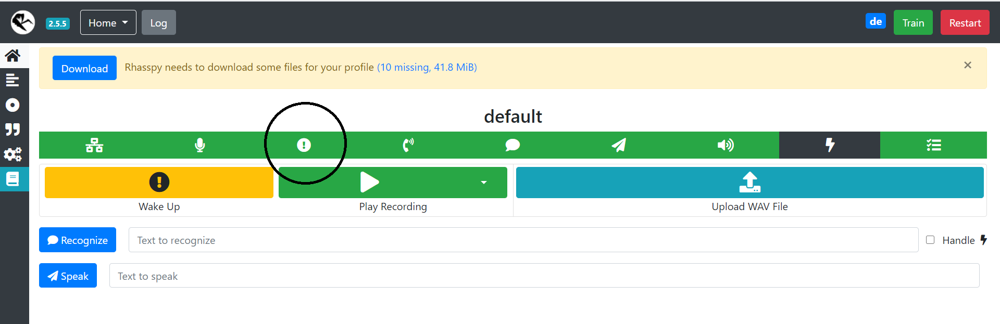
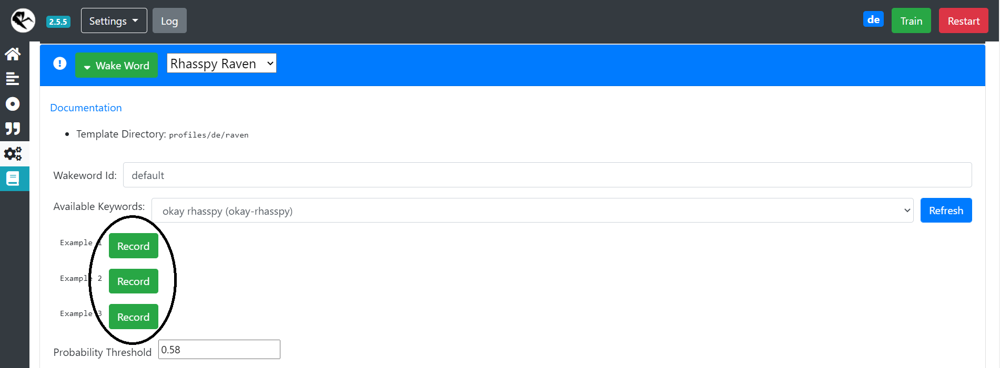
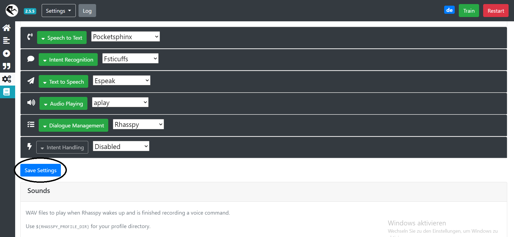

## Requirements installieren
Zuerst müssen die grundlegenden Dinge wie z.B. Git und Docker installiert werden.
Wenn es sich um eine frische Raspberry-Installation handelt, kann man hierzu das `install.sh` Skript mit sudo Rechten ausführen.


Handelt es sich allerdings um eine ältere Raspberry-Installation, sollte man die Schritte aus der install.sh manuell ausführen, um sicherzustellen dass keine bestehenden Installationen überschrieben werden oder es zu einer falschen Konfiguration kommt.

Das Skript führt die folgenden Schritte durch:
* SPI auf dem Raspberry Pi aktiveren
* docker installieren
* Nutzer `pi` zur docker-Gruppe hinzufügen
* docker-compose installieren
* Respeaker 4-Mic-Array Treiber installieren
* Vordefinierte `asound` Konfiguration setzen

Nach der installation ist ein Neustart mittels `sudo reboot` notwendig, das Skript führt diesen nicht von alleine aus.

## Sprachassistenten installieren
Wenn alle Requirements erfolgreich installiert wurden, kann man mit der Installation des eigentlichen Sprachassistenten beginnen. Zuerst muss man die Umgebungsvariablen für die docker-compose Datei seinen Bedürfnissen anpassen. Hierfür legt man auf Basis der ./docker/.env.example eine Datei ./docker/.env an und bearbeitet diese anschließend mit dem Editor seiner Wahl.

```sh
cp ./docker/.env.example ./docker/.env
```

Anschließend kann man mit docker-compose alle Services starten:

```sh
cd ./docker
docker-compose up -d
```

Nachdem die Services gestartet sind, sind sie unter folgenden Adressen erreichbar:

| Service     |                         URL                          |
| ----------- | :--------------------------------------------------: |
| Rhasspy     | [http://raspberrypi:12101](http://raspberrypi:12101) |
| Node-Red    |  [http://raspberrypi:1880](http://raspberrypi:1880)  |
| MQTT-Broker |  [mqtt://raspberrypi:1883](mqtt://raspberrypi:1883)  |

## Wake-Word einrichten

Damit der Sprachassistent perfekt auf die eigene Stimme eingestellt ist, muss nach dem ersten Start das Wake-Word eingesprochen werden. Hierzu öffnet man die Rhasspy Oberfläche [http://raspberrypi:12101](http://raspberrypi:12101) und klickt auf das Ausrufezeichen, um den Wake-Word Manager zu öffnen.



Anschließend muss das Wake-Word eingesprochen werden. Hierzu klickt man auf den Record Knopf neben Example 1 und sagt "Hey, Trixie". Das ganze wiederholt man für Example 2 und Example 3.



Wenn man mit den Sprachaufnahmen zufrieden ist müssen diese noch gespeichert werden. Hierzu scrollt man fast bis ans Ende der Seite und klickt dort auf "Save Settings".



Der Sprachassistent ist nun zur Benutzung bereit. Alle verfügbaren Features findet man [hier](/docs/features) 